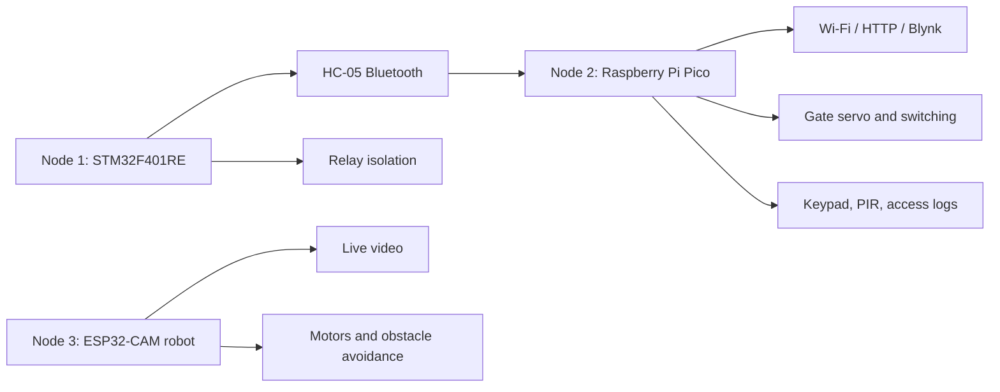

<a id="top"></a>
# 🛰️ Substation Scout

> **Autonomous High-Voltage Yard Inspector — a distributed cyber-physical system for real-time transformer monitoring, automatic fault isolation, secure gate access, cloud supervision, and robotic yard inspection.**

[]()
[]()
[]()
[]()

---

## 📖 Table of Contents

- [Overview](#overview)
- [Key Features](#key-features)
- [System Architecture](#system-architecture)
- [The Three Nodes](#the-three-nodes)
- [Hardware Specifications](#hardware-specifications)
- [Project Status](#project-status)
- [Repository Structure](#repository-structure)
- [Recommended Reading Flow](#recommended-reading-flow)
- [Configuration & Secrets](#configuration--secrets)
- [Safety Notes](#safety-notes)
- [Contributing](#contributing)
- [License](#license)

---

<a id="overview"></a>
## 📝 Overview

Substation transformers run under continuous electrical and thermal stress. Overcurrent, overheating, and hydrogen gas buildup can go unnoticed until real damage is done, and conventional setups still lean on manual inspection and standalone protection relays with no live remote view of what's happening in the yard.

**Substation Scout** replaces that gap with a distributed cyber-physical system split across three purpose-built nodes: one watches the transformer and cuts power the instant a threshold is crossed, one runs the control room — cloud dashboard, gate access, intrusion detection — and one is a camera-equipped rover that lets a person inspect the yard without walking into it.

The full engineering report — [BATCH_7_REPORT.docx](BATCH_7_REPORT.docx) — is the authoritative design reference and stays unmodified in this repository. Everything in `docs/` is a working distillation of it.

<p align="center">
  
</p>

A short demo of the inspection rover in action is available at [pictures/Video Project_out.mp4](pictures/Video%20Project_out.mp4).

**[⬆ back to top](#top)**

---

<a id="key-features"></a>
## ✨ Key Features

- **Local, network-independent protection** — the transformer is isolated by a relay the instant voltage, current, temperature, or hydrogen gas crosses a safe threshold, with no dependency on Wi-Fi, Bluetooth, or the cloud.
- **Wireless telemetry bridge** — live readings travel from the monitoring node to the control-room gateway over Bluetooth, with no industrial wiring required.
- **Cloud dashboard** — the gateway publishes measurements, transformer state, gate state, alerts, and access logs to a Blynk dashboard over Wi-Fi/HTTP.
- **Secure, logged access** — a keypad-driven employee ID/password flow opens the gate, logs every entry, and keeps a live personnel count.
- **Intrusion detection** — a PIR sensor raises a cloud alert if motion is detected while the gate is closed.
- **Remote robotic inspection** — a joystick-controlled, camera-equipped rover streams live video and pans -80° to +80°, with an ultrasonic sensor that auto-stops it before a collision.

**[⬆ back to top](#top)**

---

<a id="system-architecture"></a>
## 🏗️ System Architecture

The system follows a four-layer CPS model — physical sensors/actuators, embedded processing, wireless communication, and cloud visualization — spread across three independent nodes that stay functional even if one link goes down.



The full block diagram, data-flow diagram, and per-node firmware breakdown live in [Hardware Architecture](docs/architecture/hardware-architecture.md) and [Software Architecture](docs/architecture/software-architecture.md).

**[⬆ back to top](#top)**

---

<a id="the-three-nodes"></a>
## 🔌 The Three Nodes

| Node | Platform | Role | Source |
| --- | --- | --- | --- |
| 1 | STM32F401RE | Transformer monitoring and protection | [codes/node_1_stm_main.txt](codes/node_1_stm_main.txt) |
| 2 | Raspberry Pi Pico | Control-room and security gateway | [codes/node_3_pico.txt](codes/node_3_pico.txt) |
| 3 | ESP32-CAM | Robotic inspection unit | [codes/node_2_esp.txt](codes/node_2_esp.txt) |

> Source filenames follow the project's original internal numbering, not the report's node numbers — `node_2_esp.txt` is Node 3 above, and `node_3_pico.txt` is Node 2. The table uses the report's numbering throughout; the filenames are kept as-is to match the original snapshot.

**Node 1 — Monitoring and Protection.** Reads transformer voltage, current, hydrogen gas, and coil/oil temperature, checks each value against a safety threshold, shows live status on an OLED, and drops a relay to isolate the transformer the moment something crosses the line — entirely locally, with no dependency on the other two nodes.

**Node 2 — Control Room and Security Gateway.** Picks up Node 1's readings over Bluetooth and pushes them to the Blynk dashboard over Wi-Fi. Handles transformer switching, gate control, keypad-based employee authentication, entry logging, live personnel count, and PIR-triggered intrusion alerts.

**Node 3 — Robotic Inspection Unit.** A joystick-driven inspection rover. Streams live video from the ESP32-CAM, drives four DC geared motors through an L298N, measures obstacle distance with an ultrasonic sensor (auto-stopping near an obstacle), and pans the camera roughly -80° to +80°.

**[⬆ back to top](#top)**

---

<a id="hardware-specifications"></a>
## ⚙️ Hardware Specifications

**Node 1 — STM32F401RE Nucleo**
- AC voltage sensor and current sensor for electrical monitoring
- Hydrogen gas sensor for internal fault indication
- Two DHT11 sensors for coil and oil temperature
- SSD1306 OLED for local status display
- Relay module for transformer isolation
- HC-05 Bluetooth for the link to Node 2

**Node 2 — Raspberry Pi Pico**
- HC-05 Bluetooth interface to receive Node 1 data
- Wi-Fi connectivity for the Blynk HTTP link
- 4x4 matrix keypad for employee authentication
- Servo motor for the gate mechanism
- PIR motion sensor for intrusion detection
- Transformer switching control interface

**Node 3 — ESP32-CAM**
- ESP32-CAM module for live video streaming
- HC-SR04 ultrasonic sensor for obstacle detection
- Servo motor for camera pan (-80° to +80°)
- L298N dual H-bridge driving four DC geared motors
- 4WD chassis and rechargeable battery pack

The full bill of materials, quantities, and supporting hardware (power, level shifting, fusing, enclosure) is in [Components List](docs/hardware/components-list.md). Pin-level connections are in the [Wiring Guide](docs/hardware/wiring-diagram.md).

**[⬆ back to top](#top)**

---

<a id="project-status"></a>
## 🚧 Project Status

This repository is a **report-backed source and design snapshot**, not yet a complete, buildable product. The report in `BATCH_7_REPORT.docx` defines the intended system; the firmware in `codes/` is retained as a set of implementation snapshots that still need reconciliation with it. Specifically, still missing or unreconciled:

- STM32CubeIDE / Makefile project metadata
- ESP32-CAM Arduino/ESP-IDF or PlatformIO project metadata
- A deployable Pico `main.py`
- The STM32 `main.h` and `font5x7.inc` dependencies referenced by the source
- The report-specified HC-05 Bluetooth integration and a matching STM32 ↔ Pico message parser (the stored snapshots currently use different baud rates and cannot be wired together as-is)
- The report-specified ESP32-CAM video-streaming firmware (the current ESP32 source is a generic motor/Blynk snapshot)
- Automated tests and CI configuration

Treat any build or flash instructions as unavailable until the corresponding project files are committed — see [Project Overview](docs/architecture/project-overview.md) for the full integration status and recommended build milestones.

**[⬆ back to top](#top)**

---

<a id="repository-structure"></a>
## 🗂️ Repository Structure

```text
Substation-Scout/
│
├── docs/                              ← Documentation and operating procedures
│   ├── architecture/
│   │   ├── project-overview.md        ← Goals, node responsibilities, integration status
│   │   ├── hardware-architecture.md   ← Block diagram, per-node hardware, power/protection
│   │   └── software-architecture.md   ← Data flow, per-node firmware, communication
│   ├── hardware/
│   │   ├── components-list.md         ← Bill of materials
│   │   └── wiring-diagram.md          ← Connection tables and wiring diagrams
│   └── guides/
│       ├── blynk.md                   ← Templates, datastreams, dashboard setup
│       ├── calibration.md             ← Sensor, display, motor, servo, access checks
│       ├── configuration.md           ← Credentials and device configuration
│       ├── usage-example.md           ← Startup output, UART commands, expected behavior
│       └── troubleshooting.md         ← Fault isolation and safety-first recovery
│
├── codes/                             ← Firmware source snapshots
│   ├── node_1_stm_main.txt            ← Node 1: STM32 monitoring and protection
│   ├── node_2_esp.txt                 ← Node 3: ESP32-CAM robotic inspection
│   └── node_3_pico.txt                ← Node 2: Pico control-room gateway
│
├── pictures/                          ← Project media
│   ├── Blynk.jpeg                     ← Dashboard screenshot
│   └── Video Project_out.mp4          ← Rover demo video
│
├── BATCH_7_REPORT.docx                ← Unmodified project report (source of truth)
├── CONTRIBUTING.md                    ← Expected contribution workflow
└── SECURITY.md                        ← Credential handling and disclosure policy
```

**[⬆ back to top](#top)**

---

<a id="recommended-reading-flow"></a>
## 🗺️ Recommended Reading Flow

New to this repository? This order builds the full picture with the least backtracking:

1. **[docs/architecture/project-overview.md](docs/architecture/project-overview.md)** — system purpose, node responsibilities, and current integration status.
2. **[docs/architecture/hardware-architecture.md](docs/architecture/hardware-architecture.md)** — boards, peripherals, power, and safety.
3. **[docs/architecture/software-architecture.md](docs/architecture/software-architecture.md)** — runtime responsibilities and data flow per node.
4. **[docs/hardware/wiring-diagram.md](docs/hardware/wiring-diagram.md)** — connection tables and wiring diagrams.
5. **[docs/guides/blynk.md](docs/guides/blynk.md)** — templates, datastreams, dashboards, and terminal commands.
6. **[docs/guides/calibration.md](docs/guides/calibration.md)** — sensor, display, motor, servo, and access-control checks.
7. **[docs/guides/usage-example.md](docs/guides/usage-example.md)** — startup output, UART commands, and expected behavior.
8. **[docs/guides/troubleshooting.md](docs/guides/troubleshooting.md)** — fault isolation and safety-first recovery.

**[⬆ back to top](#top)**

---

<a id="configuration--secrets"></a>
## 🔐 Configuration & Secrets

The ESP32 and Pico source files contain placeholders for Wi-Fi credentials, Blynk auth tokens, and access PINs (`REPLACE_WITH_...`). Fill these in only on a local working copy — never commit real credentials.

See [Configuration Guide](docs/guides/configuration.md) for the full checklist. If credentials were ever exposed, revoke or rotate them before deploying the hardware — see [SECURITY.md](SECURITY.md).

**[⬆ back to top](#top)**

---

<a id="safety-notes"></a>
## ⚠️ Safety Notes

- Use level shifting and proper isolation for 5 V peripherals and relay loads — never drive an ESP32 or Pico GPIO directly from a 5 V signal.
- Test motors, servos, and relays with the load disconnected before connecting field equipment.
- Fuse high-current sources and keep an emergency disconnect available.
- Treat the default access PIN placeholder as invalid until a local PIN is configured.
- Do not connect the prototype directly to energized high-voltage equipment.

**[⬆ back to top](#top)**

---

<a id="contributing"></a>
## 🤝 Contributing

See [CONTRIBUTING.md](CONTRIBUTING.md) for the expected workflow. Every change should note the affected node, its hardware assumptions, and how it was validated.

**[⬆ back to top](#top)**

---

<a id="license"></a>
## 📜 License

No license has been declared for this snapshot yet. Add one before accepting reuse or external contributions.

---

<p align="center"><i>Built by Korukonda L K M Prem Chand, Patnana Tarun, and Vibusha M — Department of Electrical and Electronics Engineering, Amrita School of Engineering, Coimbatore.</i></p>
