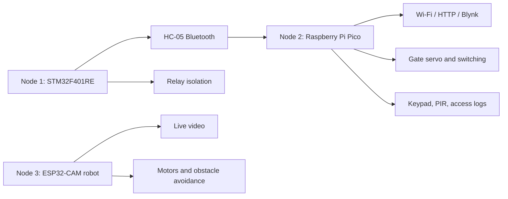

# Hardware Architecture

The report defines three independent but connected hardware nodes: transformer monitoring and protection, control-room security, and robotic inspection.

## Block Diagram

## Node 1: Monitoring and Protection

The STM32F401RE interfaces with an AC voltage sensor, current sensor, hydrogen gas sensor, two DHT11 sensors for coil and oil temperature, an OLED display, a relay module, and an HC-05 Bluetooth module. It measures transformer health parameters, compares them with safety thresholds, displays local status, and isolates the transformer when a fault condition is detected.

The current source snapshot instead names an MQ-2, ACS712, voltage divider, and local UART. Confirm the installed sensor modules and reconcile the source with the report before deployment.

## Node 2: Control Room and Security Gateway

The Raspberry Pi Pico receives Node 1 data through Bluetooth, uploads measurements to Blynk through Wi-Fi/HTTP, and manages transformer switching. Its security hardware includes a 4x4 keypad, gate servo, PIR motion sensor, and access logging/personnel count logic.

## Node 3: Robotic Inspection Unit

The ESP32-CAM provides live video from the substation yard. An HC-SR04 detects obstacles, an L298N drives four DC geared motors on a 4WD chassis, and a servo rotates the camera through approximately -80 to +80 degrees. A rechargeable battery pack powers the mobile platform.

The current ESP32 source snapshot contains motor, ultrasonic, servo, and Blynk logic but does not yet include the report's camera streaming implementation.

## Power and Protection

- Use isolated, regulated supplies for logic, motors, servos, relay coils, and the camera.
- Fuse high-current sources and provide an emergency disconnect.
- Use level shifting for every signal above the receiving MCU's voltage limit.
- Keep sensor wiring away from motor and relay wiring.
- Do not connect the prototype directly to energized high-voltage equipment.