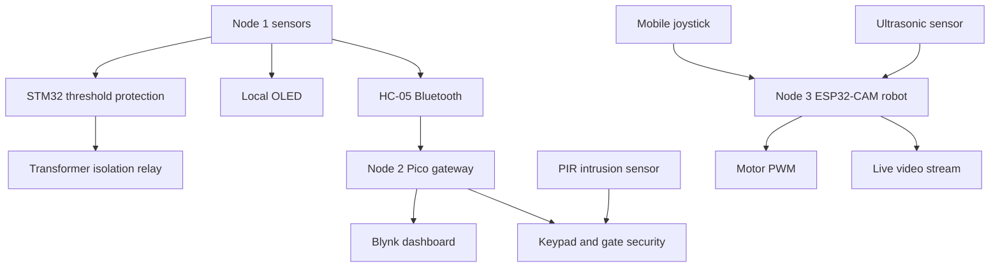

# Software Architecture

The intended software is a distributed CPS: local STM32 protection, Pico supervision/security, and ESP32-CAM robotic inspection.

## Data Flow

## Node 1 Firmware

The STM32 firmware acquires electrical, gas, and temperature values, compares them with thresholds, drives the isolation relay, refreshes the OLED, and transmits monitoring data. Protection must remain functional without cloud connectivity. The stored source currently implements a local UART command line and periodic ADC/DHT reads; Bluetooth framing and the report's sensor drivers still need to be integrated.

## Node 2 Firmware

The Pico firmware receives and parses monitoring data, writes live values to Blynk, handles transformer switching, authenticates keypad users, opens/closes the gate, records access logs, tracks personnel count, and raises PIR intrusion alerts. It uses MicroPython and should recreate its Blynk client after Wi-Fi recovery before unattended deployment.

## Node 3 Firmware

The ESP32-CAM firmware streams video, handles mobile joystick commands, drives the L298N motor controller, checks ultrasonic distance, stops on obstacles, and controls the camera pan servo. The stored source snapshot currently covers generic ESP32 motor/Blynk behavior but not camera streaming.

## Communication

- Node 1 to Node 2: HC-05 Bluetooth, with a message format still to be finalized.
- Node 2 to Blynk: Wi-Fi using HTTP/cloud API behavior.
- Mobile device to Node 3: Wi-Fi joystick and camera streaming.

The stored STM32 and Pico snapshots use different UART baud rates, so they must not be directly wired together without an agreed protocol and matching transport configuration.

## Current Source References

- [Node 1 source](../../codes/node_1_stm_main.txt)
- [Node 2 source](../../codes/node_3_pico.txt)
- [Node 3 source](../../codes/node_2_esp.txt)
- [Blynk configuration](../guides/blynk.md)